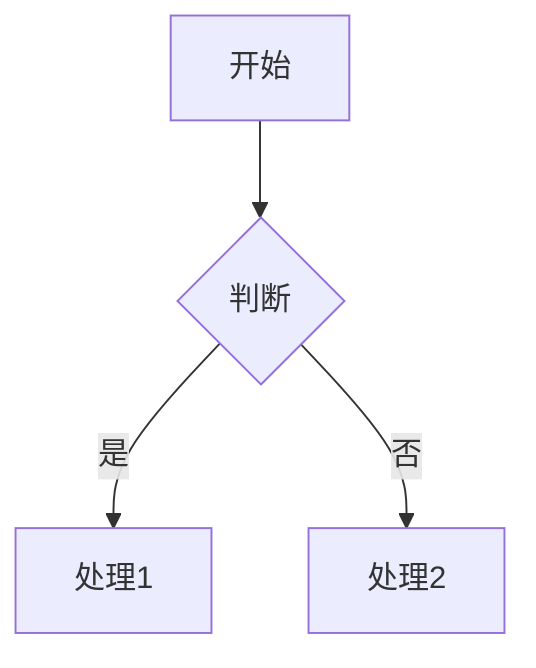

# MD2PDF Pro

<p align="center">
  <strong>批量Markdown转PDF转换器 | Batch Markdown to PDF Converter</strong>
</p>

<p align="center">
  <a href="https://pypi.org/project/md2pdf-pro/">
    
  </a>
  <a href="https://pypi.org/project/md2pdf-pro/">
    
  </a>
  <a href="https://github.com/one1d/md2pdf-pro/blob/main/LICENSE">
    
  </a>
</p>

---

## 功能特性

- **Markdown转PDF** - 支持单文件或批量转换
- **Mermaid图表** - 自动渲染Mermaid代码块为PDF图片
- **LaTeX数学公式** - 原生支持数学公式渲染
- **代码高亮** - 多语言语法高亮
- **中文排版** - 完整的中文支持
- **并行处理** - 高效批量转换
- **文件监控** - 自动监听文件变化并转换
- **PDF优化** - 压缩、元数据、水印
- **模板系统** - 内置+自定义模板
- **插件系统** - 扩展功能
- **中文期刊模板** - 学术论文模板

---

## 安装

### 1. 安装Python包

```bash
pip install md2pdf-pro
```

或从源码安装：

```bash
git clone https://github.com/one1d/md2pdf-pro.git
cd md2pdf-pro
pip install -e .
```

### 2. 安装系统依赖

**macOS:**

```bash
brew install pandoc tectonic graphviz librsvg node
npm install -g @mermaid-js/mermaid-cli
```

**Linux (Ubuntu/Debian):**

```bash
sudo apt-get install pandoc texlive-base graphviz librsvg2-bin nodejs npm
sudo npm install -g @mermaid-js/mermaid-cli
# 安装 Tectonic: https://tectonic.typesafe.org/
```

**Windows:**

```bash
# 安装 Chocolatey
choco install pandoc graphviz nodejs
# 安装 Tectonic: https://tectonic.typesafe.org/
# 安装 Mermaid-CLI: npm install -g @mermaid-js/mermaid-cli
```

### 3. 验证安装

```bash
md2pdf doctor
```

---

## 快速开始

### 单文件转换

```bash
md2pdf convert document.md -o output/
```

### 批量转换

```bash
# 转换当前目录所有md文件
md2pdf batch "*.md" -o output/

# 递归转换
md2pdf batch "docs/*.md" -o output/ -r
```

### 监听模式

```bash
# 监听文件变化自动转换
md2pdf watch ./docs -o output/
```

---

## 使用指南

### 命令行选项

#### convert - 单文件转换

```bash
md2pdf convert <input.md> [OPTIONS]

选项:
  -o, --output PATH      输出PDF路径
  -c, --config PATH     配置文件路径
  -t, --template PATH   Pandoc模板
  -w, --workers N       并发数 (默认: 8)
  
  # PDF优化选项
  --compression TEXT     压缩级别 (none/web/screen/ebook/print/prepress)
  --author TEXT         PDF作者
  --title TEXT          PDF标题
  --watermark           启用水印
  --watermark-text TEXT 水印文本
  
  # 中文期刊选项
  --journal-title TEXT  期刊名称
  --journal-vol TEXT   卷号
  --journal-issue TEXT 期号
  --journal-year TEXT  年份
  --doi TEXT           DOI编号
  --affiliation TEXT   单位
  --email TEXT         邮箱
```

#### batch - 批量转换

```bash
md2pdf batch "<pattern>" [OPTIONS]

选项:
  -o, --output PATH    输出目录
  -c, --config PATH   配置文件路径
  -r, --recursive     递归处理子目录
  -i, --ignore TEXT   忽略的模式
  -w, --workers N     并发数 (默认: 8)
  --dry-run           模拟运行
```

#### watch - 监听模式

```bash
md2pdf watch <directory> [OPTIONS]

选项:
  -o, --output PATH   输出目录
  -r, --recursive    监听子目录 (默认: True)
  -d, --debounce N   防抖延迟ms (默认: 500)
  -w, --workers N    并发数 (默认: 8)
```

#### templates - 模板管理

```bash
# 列出可用模板
md2pdf templates list

# 查看模板路径
md2pdf templates path <name>

# 初始化用户模板
md2pdf templates init <name>
```

#### plugins - 插件管理

```bash
# 列出可用插件
md2pdf plugins list

# 启用插件
md2pdf plugins enable <name>

# 禁用插件
md2pdf plugins disable <name>
```

#### config - 配置管理

```bash
# 初始化配置文件
md2pdf init

# 显示当前配置
md2pdf config-show

# 指定配置文件
md2pdf config-show -c custom.yaml
```

#### doctor - 环境检查

```bash
md2pdf doctor
```

---

## 配置文件

详细配置说明请参考 [配置文档](docs/CONFIG.md)。

创建 `md2pdf.yaml` 配置文件：

```yaml
version: "1.0.0"

mermaid:
  theme: default      # default, dark, forest, neutral
  format: pdf        # pdf, svg
  width: 1200

pandoc:
  pdf_engine: tectonic  # tectonic, xelatex, lualatex
  highlight_style: tango
  math_engine: mathspec

processing:
  max_workers: 8
  timeout: 300

output:
  output_dir: ./output
  temp_dir: /tmp/md2pdf
  optimize_pdf: true

pdf:
  compression: screen
  metadata:
    author: ""
    title: ""
  watermark:
    enabled: false
    text: "CONFIDENTIAL"

font:
  cjk_primary: "PingFang SC"
```

---

## 示例

### 带Mermaid图表的Markdown

```markdown
# 我的文档

## 流程图


```

### 带数学公式

```markdown
## 数学公式

行内公式: $E = mc^2$

块公式:
$$
\int_{-\infty}^{\infty} e^{-x^2} dx = \sqrt{\pi}
$$
```

### 中文期刊论文

```bash
md2pdf convert paper.md -o output.pdf \
  --journal-title "计算机学报" \
  --journal-vol 45 \
  --journal-issue 3 \
  --journal-year 2024 \
  --doi 10.12345/jos.2024.001 \
  --affiliation "清华大学" \
  --author "张三, 李四" \
  --email "zhangsan@tsinghua.edu.cn"
```

---

## 项目结构

```
md2pdf-pro/
├── src/md2pdf_pro/
│   ├── __init__.py        # 包初始化
│   ├── config.py          # 配置管理 (Pydantic)
│   ├── preprocessor.py    # Mermaid预处理
│   ├── converter.py       # Pandoc转换引擎
│   ├── parallel.py        # 并行处理
│   ├── watcher.py         # 文件监控
│   ├── templates.py       # 模板管理
│   ├── plugins.py         # 插件系统
│   └── cli.py             # CLI入口
├── tests/
│   ├── conftest.py       # pytest配置
│   ├── unit/             # 单元测试
│   └── integration/      # 集成测试
├── pyproject.toml        # 项目配置
├── requirements.txt      # Python依赖
├── Makefile             # 构建脚本
└── .gitignore
```

---

## 开发

```bash
# 安装开发环境
make dev

# 运行测试
make test

# 代码检查
make lint

# 格式化代码
make format
```

---

## 许可证

MIT License - see [LICENSE](LICENSE) for details.

---

## 感谢

- [Pandoc](https://pandoc.org/) - 文档转换引擎
- [Tectonic](https://tectonic.typesafe.org/) - 现代TeX引擎
- [Mermaid](https://mermaid.js.org/) - 图表渲染
